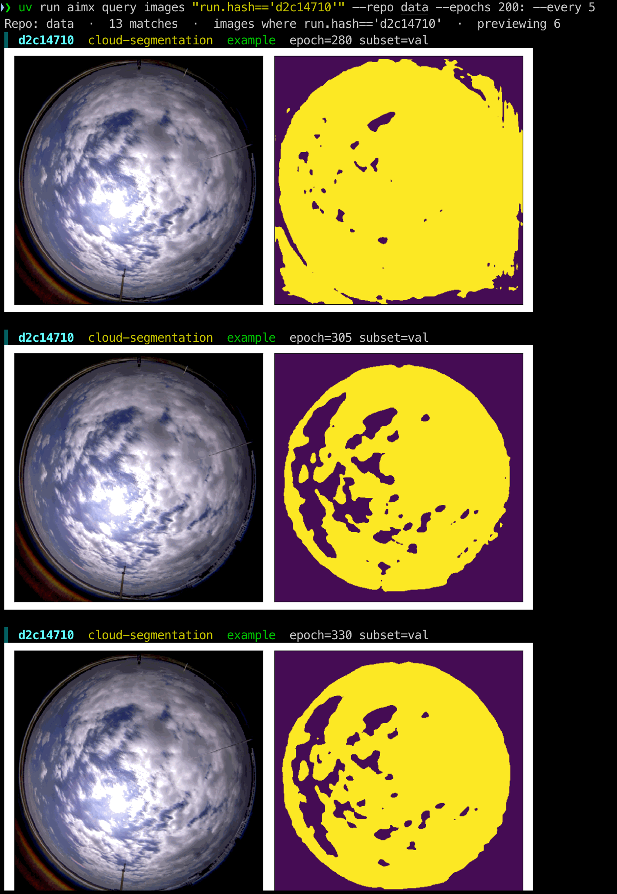
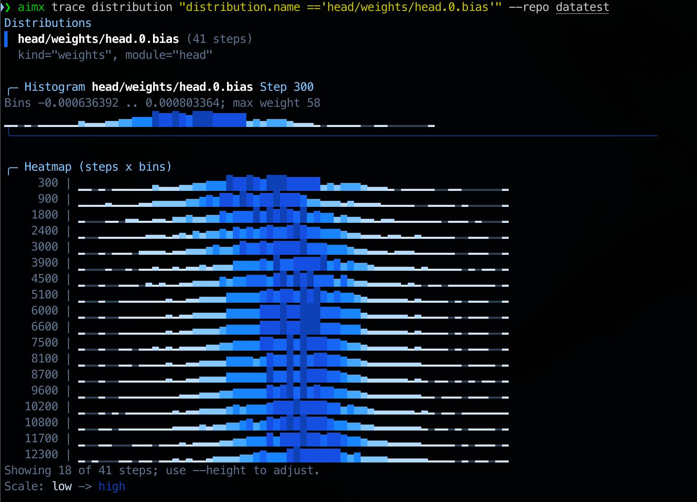

# aimx


[](./LICENSE)
[](./pyproject.toml)
[](https://pypi.org/project/aimx/)
[](https://github.com/blizhan/aimx/actions/workflows/CI.yaml)
[](https://github.com/blizhan/aimx/actions/workflows/publish.yaml)

`aimx` is a safe, additive, CLI-first companion for native [Aim](https://github.com/aimhubio/aim).

It adds focused terminal workflows for querying, comparing, previewing, and
exporting Aim run data. Commands that `aimx` does not own are delegated to the
native [`aim`](https://github.com/aimhubio/aim) executable already available in
the user's environment.


## Quick Start

### Install

```bash
# install into the current project
uv add aimx

# Or use pip
pip install aimx
```

### Install the agent skill

This repository also includes an `aimx` skill for agent workflows such as
`autoresearch` `log_experiment`, where an LLM needs to collect run parameters,
metric summaries, traces, and image evidence from a local Aim repository.

```bash
npx skills install blizhan/aimx
```

After installation, invoke the skill as `$aimx`. The skill assumes the `aimx`
CLI is available in the environment that performs the experiment inspection.

### Check your environment

```bash
aimx --help
aimx version
aimx doctor
```

### Query an Aim repository

If your current working directory is an Aim repo root, `--repo` can be omitted.
When provided, `--repo` accepts either the repository root, such as `data`, or
the metadata directory itself, such as `data/.aim`.

```bash
# Summarize matching metrics
aimx query metrics "metric.name == 'loss'" --repo data

# Preview matching images in supported terminals
aimx query images "images" --repo data

# Compare run parameters across matching runs
aimx query params "run.hash != ''" --repo data

# Plot a metric time series
aimx trace "metric.name == 'loss'" --repo data
```

## Features

- **Safe native Aim coexistence**: `aimx` does not replace the `aim` executable
  or modify installed Aim packages.
- **Explicit command ownership**: owned `aimx` commands stay small and focused;
  everything else is passed through to native Aim.
- **Scriptable query output**: query metrics, images, and run params as rich
  terminal tables, plain text, or JSON.
- **Terminal image previews**: render Aim image artifacts inline when the
  terminal supports graphics, with a safe text fallback.
- **Metric tracing**: plot, tabulate, or export matching time series with step
  filters and sampling controls.
- **Read-only defaults**: inspection, query, diagnostic, and passthrough flows
  do not mutate `.aim` repository data.

## Commands

### Owned commands

| Command | Purpose |
| --- | --- |
| `aimx` / `aimx --help` / `aimx help` | Show CLI help and owned command guidance. |
| `aimx version` | Print the installed `aimx` version. |
| `aimx doctor` | Check whether native Aim is available for passthrough. |
| `aimx query metrics` | Summarize matching metric series. |
| `aimx query images` | List and optionally preview matching image records. |
| `aimx query params` | Compare run-level parameters across matching runs. |
| `aimx trace` | Plot, tabulate, or export metric time series. |

Both `aimx query` and `aimx trace` accept **AimQL** expressions as their filter
argument. AimQL is Aim's native Python-like query language.

```bash
aimx query metrics "metric.name == 'loss' and run.hparams.learning_rate > 0.001"
```

For syntax, supported properties (`run.*`, `metric.*`, `images.*`), and
security restrictions, see
[Aim - Query language basics](https://aimstack.readthedocs.io/en/latest/using/search.html).

### Query metrics

`aimx query metrics` groups matching metric series by run and reports useful
statistics such as step count, last value, min value, and max value.


```bash
# Rich table, colored in terminals by default
aimx query metrics "metric.name == 'loss'" --repo data

# Short run hashes are transparently expanded to full hashes
aimx query metrics "run.hash == 'eca37394' and metric.name == 'loss'" --repo data

# Tab-separated output for shell tools
aimx query metrics "metric.name == 'loss'" --repo data --oneline

# Structured JSON, nested by run
aimx query metrics "metric.name == 'loss'" --repo data --json

# Step or epoch windows
aimx query metrics "metric.name == 'loss'" --repo data --steps 100:500
aimx query metrics "metric.name == 'loss'" --repo data --epochs 1:10

# Density sampling
aimx query metrics "metric.name == 'loss'" --repo data --head 20
aimx query metrics "metric.name == 'loss'" --repo data --tail 20
aimx query metrics "metric.name == 'loss'" --repo data --every 5
```

### Query images

`aimx query images` reads image metadata and, when possible, renders matched
images directly in the terminal.



```bash
# Inline preview in modern terminals
aimx query images "images" --repo data

# Metadata output only
aimx query images "images" --repo data --plain
aimx query images "images" --repo data --json

# Filter and sample matching image rows
aimx query images "images" --repo data --epochs 10:50 --head 10

# Control the TTY preview cap
aimx query images "images" --repo data --max-images 20
aimx query images "images" --repo data --max-images 0
```

When stdout is a TTY and `aimx` detects a graphics-capable terminal, matched
images render inline. On plain ANSI terminals, `aimx` falls back to half-block
character art and still exits with code `0`.

Terminal rendering is provided by
[`textual-image`](https://github.com/lnqs/textual-image/tree/main#support-matrix-1).
Confirmed working terminals include iTerm2, Kitty, Konsole, WezTerm, foot, tmux
(Sixel), xterm (Sixel), Windows Terminal, and VS Code integrated terminal. Warp
and GNOME Terminal are not supported.

To disable inline rendering, redirect stdout or use `--plain` / `--json`.

### Query run params

`aimx query params` reads run-level Aim metadata without modifying the
repository. By default, it shows a readable set of discovered parameter columns.
Use `--param KEY` one or more times to align specific flattened params across
matching runs.


```bash
# Compare discovered params across all matching runs
aimx query params "run.hash != ''" --repo data

# Select specific params
aimx query params "run.experiment == 'cloud-segmentation'" --repo data \
  --param hparam.lr \
  --param hparam.optimizer

# Script-friendly output
aimx query params "run.experiment == 'cloud-segmentation'" --repo data --plain
aimx query params "run.experiment == 'cloud-segmentation'" --repo data --json

# Filter with AimQL run fields
aimx query params "run.hparam.lr == 0.0001" --repo data --param hparam.lr
```

Missing selected params are displayed as `-` in terminal/plain output and listed
under `missing_params` in JSON.

### Trace metrics

`aimx trace` fetches the full value sequence for one or more matching metrics
and renders a curve, table, CSV, or JSON export. Multiple matching runs are
overlaid on the same plot.

```bash
# Plot all matching loss curves
aimx trace "metric.name == 'loss'" --repo data

# Plot one run by short hash
aimx trace "run.hash == 'eca37394' and metric.name == 'loss'" --repo data

# Step-by-step table
aimx trace "metric.name == 'loss'" --repo data --table

# CSV or JSON export
aimx trace "metric.name == 'loss'" --repo data --csv > loss.csv
aimx trace "metric.name == 'loss'" --repo data --json

# Step filtering and sampling
aimx trace "metric.name == 'loss'" --repo data --steps 100:500
aimx trace "metric.name == 'loss'" --repo data --head 50
aimx trace "metric.name == 'loss'" --repo data --every 10
```

Output modes: default plot, `--table`, `--csv`, `--json`.
Display controls: `--width W`, `--height H`, `--no-color`.

### Trace distributions

`aimx trace distribution` fetches tracked Aim distribution sequences. By
default it prints the matched distribution names, selects the first match, and
renders a non-interactive Rich terminal visual with a web-style blue-gradient
current-step histogram and step-by-bin heatmap. Use `--table`, `--csv`, or
`--json` for tensor inspection and scripting.



```bash
# Show a web-like terminal visual for the first matched distribution
aimx trace distribution "distribution.name != ''" --repo data

# Inspect a specific training step; nearest tracked step is used if needed
aimx trace distribution "distribution.name != ''" --repo data --step 12300

# Show distribution tensors in a readable table
aimx trace distribution "distribution.name == 'weights'" --repo data --table

# Export distribution histograms for scripting
aimx trace distribution "distribution.name == 'weights'" --repo data --csv
aimx trace distribution "distribution.name == 'weights'" --repo data --json
```

### Common query options

- Output: `--json`, `--oneline` / `--plain`, or the default rich terminal view.
- Filtering: `--steps start:end` or `--epochs start:end` where supported.
- Sampling: `--head N`, `--tail N`, `--every K`.
- Images: `--max-images N` controls the TTY preview cap.
- Params: `--param KEY` can be repeated to select parameter columns.
- Diagnostics: `--verbose` prints additional details where supported.

### Native Aim passthrough

Any unowned command path is passed through to native `aim`.

```bash
aimx up
aimx init --help
aimx runs --help
aimx runs ls
```

## Documentation

- [AimQL query language](https://aimstack.readthedocs.io/en/latest/using/search.html)
  explains the filter syntax used by `aimx query` and `aimx trace`.
- [textual-image terminal support](https://github.com/lnqs/textual-image/tree/main#support-matrix-1)
  lists terminals that can render inline images.
- [CONSTITUTION.md](./CONSTITUTION.md) documents the project safety and scope
  rules.
- [specs/](./specs) contains feature specs, plans, contracts, and quickstarts
  for implemented `aimx` capabilities.
- [TODO.md](./TODO.md) tracks early roadmap notes.

## Runtime Contract

- `aimx` does not replace the `aim` executable.
- `aimx` does not modify the installed `aim` package.
- `aimx` does not mutate `.aim` data during help, version, doctor, query,
  trace, or passthrough flows.
- Native Aim remains an external runtime prerequisite for delegated commands.
- The repository's development dependency on Aim is only for local development
  and testing convenience.

## Development

The project uses Python 3.12 for local development and supports
`>=3.10,<3.13` at runtime.

```bash
uv python install 3.12
uv venv --python 3.12
uv sync --group dev
uv run pytest
```

Useful local checks:

```bash
uv run aimx --help
uv run aimx version
uv run aimx doctor
uv run aimx query metrics "metric.name == 'loss'" --repo data
uv run aimx query images "images" --repo data/.aim --json
```
